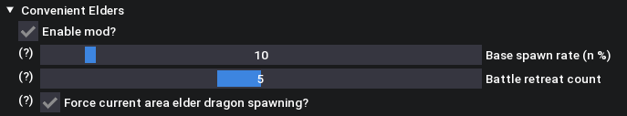

# MHST3 Convenient Elders

Makes calamitous elder dragon spawning much more convenient compared to the base/vanilla game. 

## Features

- Adjust elder dragon spawn chance between 0 - 100%
	- Default: 10%
- Adjust elder dragon despawn/retreat rate (= how many battles until it leaves) between 1 and 10 (battles)
	- Default: 5 (battles)
- Forcefully spawn elder dragon from the current area (i.e., night battles in azuria guarantees azuria elder dragon spawn)